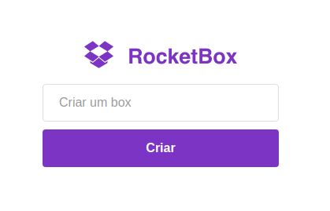
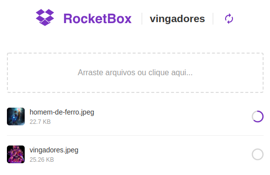
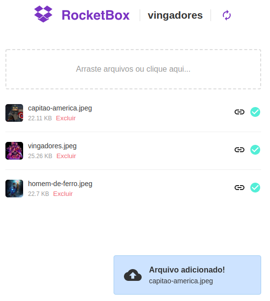
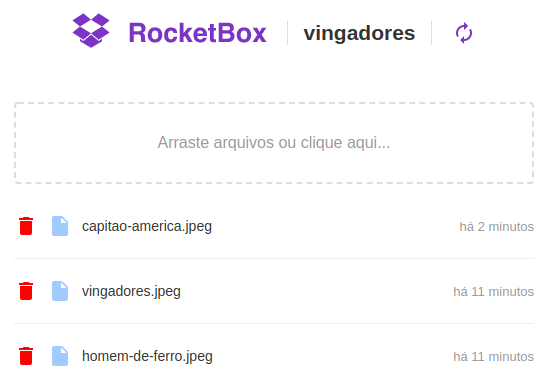

## :rocket: Semana Omnistack #6 | Rocketseat

- Desenvolvimento de uma aplicação utilizando a stack **Node.js**, **ReactJS** e **React Native**.
- A aplicação é similar ao Dropbox, onde é possível criar uma sala/caixa e nela fazer upload de seus arquivos.
- Através de um _websocket_ foi feita a comunicação cliente/servidor em tempo real para apresentação de quando alguém adiciona novos arquivos a uma determinada caixa.
- **Feito a parte:**
  - Node.js
    - Upload para amazon s3.
    - Permitido deletar arquivos.
  - ReactJS
    - Novo layout dos itens.
    - Mostrar progresso do upload.
    - Limitado somente para imagens de no máximo 2mb.
    - Estilização da caixa de drop de acordo com o arquivo.
    - Permitido deletar arquivos.
    - Informa que arquivo foi deletado em real-time também.
    - Adicionado notificação para quando adiciona e deleta novos aquivos.
  - React Native
    - Informa que arquivo foi deletado em real-time também.
    - Permitido deletar arquivos.
- Repositórios do projeto:

  - [backend](https://github.com/viniciusecp/rocketbox-backend)
  - [frontend](https://github.com/viniciusecp/rocketbox-frontend)
  - [mobile](https://github.com/viniciusecp/rocketbox-mobile)

### Telas

- Login da aplicação, onde o usuário escolhe a caixa que deseja entrar.

<h1 align="center">
  
</h1>

- Tela principal, nesta imagem é mostrado um circulo que representa o progresso de upload da imagem.

<h1 align="center">
  
</h1>

- Quando uma imagem é adicionada por outra pessoa na mesma caixa, todos que estão na mesma caixa recebem uma notificação do novo item.

<h1 align="center">
  
</h1>

- Layout antigo.

<h1 align="center">
  
</h1>

## :memo: License

Esse projeto está sob a licença MIT. Veja o arquivo [LICENSE](LICENSE.md) para mais detalhes.

---

Feito com ♥ by Vinicius Faustino Silva :wave: [Get in touch!](https://www.linkedin.com/in/vinícius-silva-019aa0165)
